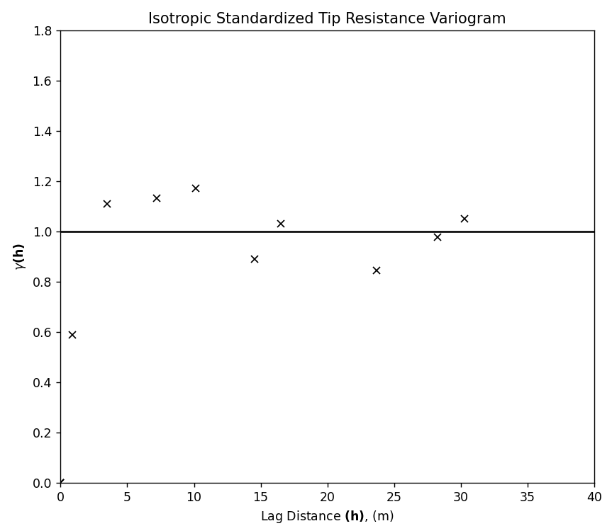
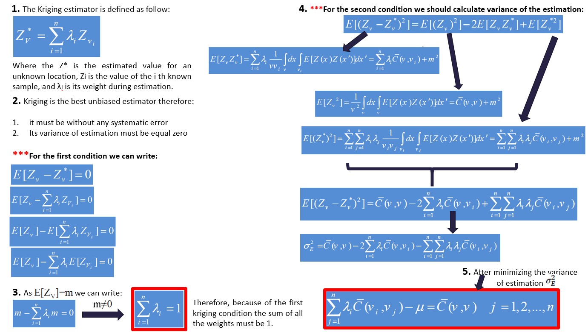
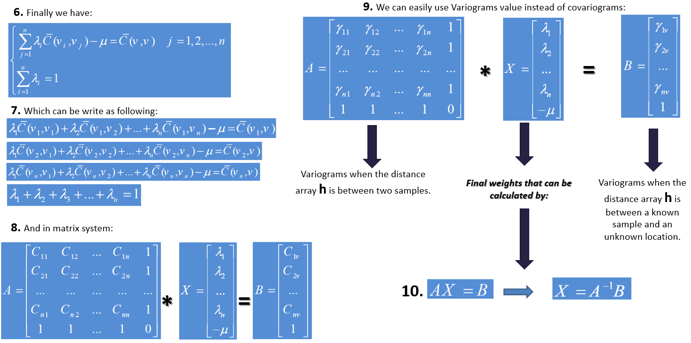
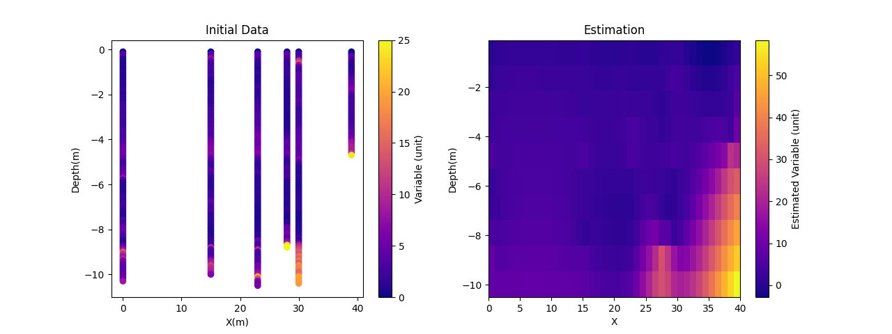

# Krigin from Scratch


```python
import numpy as np
import pandas as pd
from math import *
import matplotlib
matplotlib.use('TkAgg')
from matplotlib import pyplot as plt
```

### Variogram Modeling
Insert your variogram model results.

Here, my model is spherical with a range of 4m, sill = 1, and nugget = 0.

You can change the parameters as you want.

You can create your variogram model and find more about variogram modeling in my other repository at the following link: https://github.com/Mohammadali96/Geostatistical-Simulation/tree/main





```python
nugget = 0
sill = 1
rang = 4

```

### Kriging Mathematics





### Making Matrix A and B


```python
def semivariance (nug, sil, ran, h):
    sv = nug + sil*(3/2*h/ran-0.5*(h/ran)**3)
    if sv.shape[0] > 1:
        onescol = np.ones(sv.shape[0])
        sv = np.insert(sv, sv.shape[1], onescol, axis=1)
        onesrow = np.ones(sv.shape[1])
        sv = np.insert(sv, sv.shape[0], onesrow, axis=0)
        sv[sv.shape[0]-1][sv.shape[1]-1] = 0
    else:
        onescol = np.ones(sv.shape[0])
        sv = np.insert(sv, sv.shape[1], onescol, axis=1)
        sv = sv.transpose()
    return sv
```

### Finding distances between known locations 


```python

def distancematrix(X, Y):
    templist = []
    for i, j in zip(X, Y):
        for e, d in zip(X, Y):
            dist = sqrt((((i - e) ** 2 + (j - d) ** 2)))
            templist.append(dist)
    distancemat = np.array([templist[x:x + len(X)] for x in range(0, len(templist), len(X))])
    return distancemat

```

### Finding distances between known and unknown locations 


```python

def distanceUn(X1, Y1, X2, Y2):
    lst = []
    for k, l in zip(X2, Y2):
        dist = sqrt((((X1 - k) ** 2 + (Y1 - l) ** 2)))
        lst.append(dist)
    unknown = np.array([lst])
    return unknown
```

### Calculating Weights and Ordinary Kriging


```python
def OK (dataX,dataY,unknownX,unknownY,Variable):
    Var1 = np.reshape(Variable, (Variable.shape[0],1))
    Var1 = Var1.transpose()
    matdist_N = distancematrix(dataX,dataY)
    matdist_U = distanceUn(unknownX,unknownY,dataX,dataY)
    N_SV = semivariance(nugget,sill,rang,matdist_N)
    U_SV = semivariance(nugget,sill,rang,matdist_U)
    inv_N_SV = np.linalg.inv(N_SV)
    Weights = np.matmul(inv_N_SV, U_SV)
    Weights = np.delete(Weights,Weights.shape[0]-1,0)
    Estimation = np.dot(Var1, Weights)
    return Estimation[0]
```

### Making grid and defining interpolation area based on dataset


```python
def interpolation(X,Y,Variable,ResX, ResY):
    ResolutionX = ResX
    ResolutionY = ResY
    X_mesh = np.linspace(np.amin(X) , np.amax(X) + 1, ResolutionX)
    y_mesh = np.linspace(np.amin(Y), np.amax(Y) , ResolutionY)
    XX, YY = np.meshgrid(X_mesh, y_mesh)
    EX = []
    EY = []
    EZ = []

    for x in np.nditer(XX):
        EX.append(float(x))
    for y in np.nditer(YY):
        EY.append(float(y))

    Grid1 = pd.DataFrame(data={'X': EX, 'Y': EY})
    for index, rows in Grid1.iterrows():
        estimated = OK(X, Y, rows['X'], rows['Y'], Variable)
        EZ.append(float(estimated))  # Ensure each estimate is a flat float, not a list


    Grid = pd.DataFrame(data={'X': EX, 'Y': EY, 'Z': EZ})
    return Grid
```

## Estimation
### Importing Data


```python
dataset = pd.read_csv("All Data.csv")
X = dataset['X'].to_numpy()
Y = dataset['Y'].to_numpy()  
Var = dataset['Var'].to_numpy()
```

### Defining Grid Resolution


```python

MyResX = 40   # Grid cells in X dir
MyResY = 10   # Grid cells in Y dir

```

### Runing Kriging


```python
estimated_var = interpolation(X, Y, Var, MyResX,MyResY)
print(estimated_var)
```

    C:\Users\Rezaee\AppData\Local\Temp\ipykernel_12380\123522822.py:19: DeprecationWarning: Conversion of an array with ndim > 0 to a scalar is deprecated, and will error in future. Ensure you extract a single element from your array before performing this operation. (Deprecated NumPy 1.25.)
      EZ.append(float(estimated))  # Ensure each estimate is a flat float, not a list
    

                 X     Y         Z
    0     0.000000 -10.5  8.561886
    1     1.025641 -10.5  7.898634
    2     2.051282 -10.5  8.107548
    3     3.076923 -10.5  8.246407
    4     4.102564 -10.5  8.361870
    ..         ...   ...       ...
    395  35.897436  -0.1 -2.883704
    396  36.923077  -0.1 -2.432144
    397  37.948718  -0.1 -1.252560
    398  38.974359  -0.1 -0.048255
    399  40.000000  -0.1  1.540467
    
    [400 rows x 3 columns]
    

### Plot the Results


```python
# Extract X, Y, Z from estimated_var
X_grid = estimated_var['X'].to_numpy()
Y_grid = estimated_var['Y'].to_numpy()
Z_grid = estimated_var['Z'].to_numpy()

# Reshape Z to match the meshgrid shape
Z_reshaped = Z_grid.reshape(MyResY, MyResX)  

# Plot the entire grid
plt.figure()
plt.subplot(122)
plt.title('Estimation')
plt.imshow(Z_reshaped, extent=[np.min(X_grid), np.max(X_grid), np.min(Y_grid), np.max(Y_grid)], origin='lower', cmap='plasma', aspect='auto')
plt.colorbar(label='Estimated Variable (unit)')
plt.xlabel('X')
plt.ylabel('Depth(m)')

# plot initial data
plt.subplot(121)
xx = dataset['X'].to_numpy()
yy = dataset['Y'].to_numpy()  
zz = dataset['Var'].to_numpy()

sc= plt.scatter(xx, yy, c=zz, vmin=0, vmax=25, cmap='plasma')
plt.title('Initial Data')
plt.xlabel('X(m)')
plt.ylabel('Depth(m)')
plt.colorbar(label='Variable (unit)')
plt.show()
```


